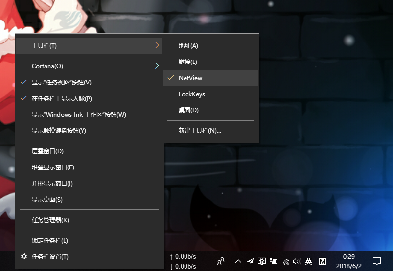

NetView
===

Language
---
- [中文](./README_zh.md)
- [English](./README.md)

Foreword
---
Near graduation, due to graduation project requirement, I was busy studying machine learning, so I hadn't written `c++` code for a long time. Recently I was trying to write a different code, and happened to want to make a small thing. So I tried to do this thing during the time of graduation design.

Introduction
---
This is a desktop taskbar plug-in for viewing real-time network speeds. It uses the COM object technology of the custom `DeskBand`, and obtains the interface information and data of the network card with Microsoft's API, `GetIfTable`, to calculate and finish network speed monitoring. The rendering is as follows:

Instruction
---
Download the release version in the release field and double-click on register.bat to complete the plug-in registration. Right-click on the taskbar menu, click the secondary menu appears on the toolbar, select the newly registered `NetView`.

Testing Platform
---
Windows10 x64

If there is a problem with other platforms, please inform me in `issue`, thanks~

Bug Fixed
---
I misunderstand the data-rate unit before. In fact, network traffic unit is often described as `bit rate`,  which uses the bits per second unit("bit/s" or "bps") to quantify.
> 1Kbit/s = 1000bit/s
> 1Mbit/s = 1000Kbit/s
> 1Gbit/s = 1000Mbit/s

Sometimes, bytes per second unit("B/s") also can be used to quantify `bit rate`.
> 1B/s = 8bit/s

Bug Remaining
---
I don't know whether it is so frequent to refresh that flash will occur in `NetView`  sometimes. And after it has been running for a long time, the Explorer memory will explode.

Anyone who can help me to sovle this problem would be nice! :grin:

Reference
---
- [DeskBand实现之——对象介绍 - CSDN][1]
- [GetIfTable function - MSDN - Microsoft][2]
- [LockKeys - slivermeteor][3]

[1]: https://blog.csdn.net/leehong2005/article/details/8608783 "DeskBand实现之——对象介绍"
[2]: https://msdn.microsoft.com/en-us/aa365943?f=255&MSPPError=-2147217396 "GetIfTable function"
[3]: https://github.com/slivermeteor/LockKeys.git "LockKeys"
